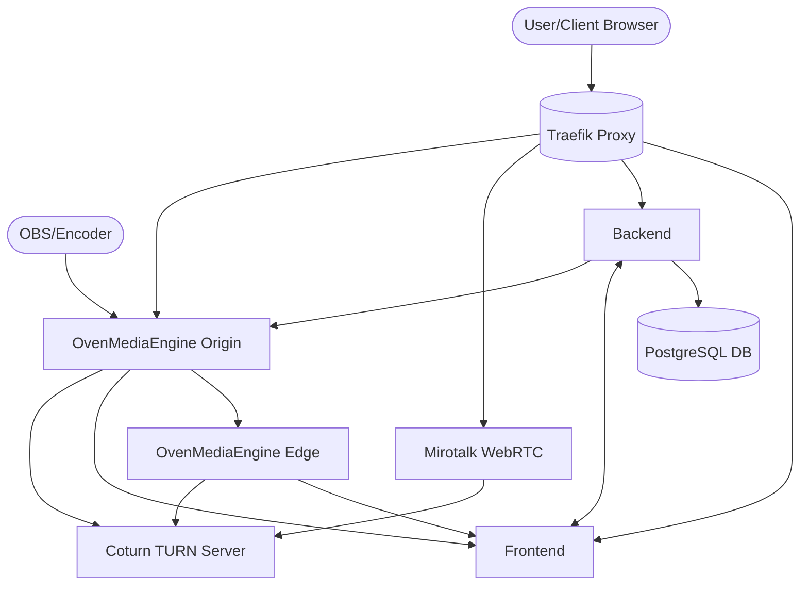

# 🏳️‍🌈 ColourStream: A Self Hosted Livestream Colour Grading Review Platform for Colourists


## 🚀 Overview

ColourStream is a self-hosted livestreaming review platform designed for colourists by a colourist. Powered by OvenMediaEngine and Mirotalk (AGPL), it provides potential end-to-end latency of less than 5 frames, making it perfect for real-time collaboration and client reviews.

💡 **Built by A Colourist, for colourists** - with features specifically designed for the unique needs of color grading professionals. Unlike Grading over Zoom,Teams or another Video Meeting App, Colourstream is a purpose built application designed from the ground up with colourgrading in mind leveraging OvenMediaEngine to ensure a fully accurate Colour Pipeline Workflow

## ✨ Key Features

- **⚡️ Ultra-Low Latency**: Experience less than 5 frames of latency for real-time collaboration
- **🔐 Modern Authentication**: Secure passwordless authentication using WebAuthn/passkeys
- **🎭 Multi-Room Support**: Host multiple review sessions simultaneously with separate rooms - this is currently functional but the automatic OBS control will not run. 
- **🔄 OBS Integration**: Stream directly from OBS or other RTMP/SRT sources
- **💬 Built-in Video Conferencing**: Real-time communication via Mirotalk's WebRTC capabilities
- **🛡️ Secure by Design**: End-to-end security for your sensitive content, Colourstream folllows Industry Best practices and uses a full SSL pipeline to ensure your review remains safe, 
- **🎛️ Admin Dashboard**: Manage users, rooms, and streaming settings
- **📱 Device Compatibility**: Works across desktop and mobile devices

## 🏗️ System Architecture

The ColourStream platform consists of several integrated components:


### 🧩 Components

- **Frontend**: React-based SPA for user interaction and stream viewing
- **Backend**: Node.js API with Prisma ORM for business logic
- **OvenMediaEngine**: Handles video streaming (SRT, RTMP, WebRTC)
- **Mirotalk**: Provides WebRTC-based video conferencing
- **Traefik**: Manages routing, SSL termination, and load balancing
- **PostgreSQL**: Stores user data, room configurations, and system settings

## 🔒 Authentication

ColourStream uses a modern, secure authentication system that prioritizes passkey (WebAuthn) authentication:
- 🔑 Passwordless authentication using device biometrics
- 🔄 Automatic transition from password to passkey authentication
- 🛡️ Enhanced security with WebAuthn standard
- 🎟️ JWT-based authentication for secure service-to-service communication

For detailed information about the authentication system, see [Authentication Documentation](docs/authentication.md).
For information about JWT key naming conventions, see [JWT Keys Documentation](docs/jwt_keys.md).

## 🖥️ Streaming Architecture

### OvenMediaEngine Configuration

ColourStream leverages OvenMediaEngine's powerful streaming capabilities:

#### Origin Server
- Primary streaming ingest point
- Supports RTMP, SRT, and WebRTC inputs
- Handles transcoding and adaptive bitrate streaming
- Distributes to edge servers for scalability

#### Optional Edge Server can be setup to, although all functionality can be done by the Origin Server if needed. 

- Distributes streams to viewers
- Supports WebRTC and LLHLS playback
- Optimized for low-latency delivery


### Video Conferencing

Mirotalk provides real-time video communication:
- WebRTC-based peer-to-peer conferencing
- Integrated with the streaming platform for seamless reviews
- Accessible via `video.colourstream.[domain]`

## 🌐 Networking

All containers communicate through the `colourstream_network` Docker network:
- Traefik handles external access to web applications
- OvenMediaEngine exposes specific ports for streaming protocols
- Internal services communicate securely within the Docker network

## 🔐 Security

### SSL/TLS Certificates

The system uses Traefik's Built in ACME for SSL/TLS certificates with automatic renewal:
- Certificate resolver: letsencrypt
- Challenge type: HTTP
- Certificate storage: ./traefik/acme.json

### Secret Detection

This repository uses [Gitleaks](https://github.com/gitleaks/gitleaks) to detect and prevent hardcoded secrets in the codebase.

For more security information, see [SECURITY.md](SECURITY.md).

## 🚀 Getting Started

### Option 1: Local Build Setup
Run the setup-template.sh script to configure your environment with local builds:
```bash
./setup-template.sh
```

### Option 2: Pre-built Container Images
For a faster setup using pre-built images from GitHub Container Registry:
```bash
curl -s https://raw.githubusercontent.com/johnr24/colourstream/main/setup-ghcr.sh | bash
```

This script will:
1. Download the necessary configuration files
2. Generate secure random passwords and secrets
3. Configure the application to use the GHCR images
4. Create all required directories and environment files

After setup, start the application with:
```bash
docker-compose up -d
```

For more information about using the GitHub Container Registry images, see [GHCR.md](GHCR.md).

## �� Documentation

- [API Endpoints](docs/api-endpoints.md)
- [Authentication Flow](docs/authentication.md)
- [Token Flow](docs/token-flow.md)
- [OBS Integration](docs/obs-integration.md)
- [WebAuthn Implementation](docs/WEBAUTHN.md)

## 🔧 Advanced Configuration

For advanced configuration options, refer to Docker Compose files and environment templates:
- `docker-compose.yml`: Main service configuration
- `global.env.template`: Global environment variables
- `backend/.env.template`: Backend-specific configuration
- `frontend/.env`: Frontend configuration

## 📜 License

ColourStream is licensed under a custom license that includes a "Pride Flag Covenant" and the GNU Affero General Public License (AGPL). The license requires that the 🏳️‍🌈 Pride Flag symbol be maintained in all project branding and documentation as a core part of its identity.

**Important**: The license includes a strong anti-DEI removal protection clause with a £1,000,000 financial penalty for any entity that removes or alters the Pride Flag symbol. By using this software, you explicitly agree to these terms.

See the [LICENSE](LICENSE) file for complete details.

The project incorporates the following components with their respective licenses:
- OvenMediaEngine: Licensed under AGPL-3.0
- Mirotalk: Licensed under AGPL-3.0
- UI elements from UK Government Design System: Available under MIT license 
  (https://github.com/alphagov/govuk-design-system)
