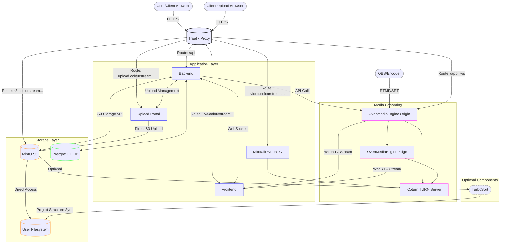

# 🏳️‍🌈 ColourStream: A Self Hosted Suite of Open Source Tools for Colourists


## 🚀 Overview

ColourStream has evolved into a comprehensive suite of open source tools designed to assist the everyday colorist with their workflows. By being self-hosted, ColourStream won't succumb to "enshittification" - the common degradation of platforms as they prioritize profit whislt actively making the user experience worse.

Powered by OvenMediaEngine and Mirotalk (AGPL), ColourStream provides potential end-to-end latency of less than 5 frames, making it perfect for real-time collaboration and client reviews.

ColourStream Uploader streamlines file transfers by eliminating the need for multiple transfer applications. The workflow is simple: create a client profile, set up a project, and generate a secure, time-limited upload link. This unique hashed link allows clients to easily and safely transfer files directly to your system. 

We reccomend our sister application "TurboSort https://github.com/johnr24/TurboSort" which works in tandem to link Colourstream Uploaders File Structure with your existing Project File Structure

💡 **Built by A Colourist, for Colorists** - with features specifically designed for the unique needs of colour grading professionals. Unlike grading over Zoom, Teams or another video meeting app, ColourStream is a purpose-built application designed from the ground up with colour grading in mind, leveraging OvenMediaEngine to ensure a fully accurate Colour Pipeline Workflow

## ✨ Key Features

- **⚡️ Ultra-Low Latency**: Experience less than 5 frames of latency for real-time collaboration
- **🔐 Modern Authentication**: Secure passwordless authentication using WebAuthn/passkeys
- **🎭 Multi-Room Support**: Host multiple review sessions simultaneously with separate rooms - this is currently functional but the automatic OBS control will only control one room. manual stream key copy and paste is still availible 
- **🔄 OBS Integration**: Stream directly from OBS or other RTMP/SRT sources
- **💬 Built-in Video Conferencing**: Real-time communication via Mirotalk's WebRTC capabilities
- **🛡️ Secure by Design**: End-to-end security for your sensitive content, Colourstream folllows Industry Best practices and uses a full SSL pipeline to ensure your review remains safe, 
- **🎛️ Admin Dashboard**: Manage users, rooms, and streaming settings
- **📱 Device Compatibility**: Works across desktop and mobile devices
- **📤 Upload Portal**: Secure file sharing with clients through a dedicated upload portal
- **📜 File Management**: Organize and manage client files with project-based structure

## 🏗️ System Architecture

The ColourStream platform consists of several integrated components:


### 🧩 Components

- **Frontend**: React-based SPA for user interaction and stream viewing
- **Backend**: Node.js API with Prisma ORM for business logic
- **OvenMediaEngine**: Handles video streaming (SRT, RTMP, WebRTC)
- **Mirotalk**: Provides WebRTC-based video conferencing
- **Upload Portal**: Secure file sharing portal for client uploads and downloads
- **MinIO**: S3-compatible object storage for file uploads and storage
- **Traefik**: Manages routing, SSL termination, and load balancing
- **PostgreSQL**: Stores user data, room configurations, and system settings
- **TurboSort**: Optional tool for linking uploaded files to existing project structure
- **User Filesystem**: Local storage where media files are ultimately accessed for grading work

## 📤 Upload Portal

ColourStream includes a dedicated upload portal that allows clients to securely share large media files with colorists:

- **🔗 Shareable Links**: Generate time-limited upload links to share with clients
- **📂 Project Organization**: Organize uploads by client and project for easy management
- **↪️ Resumable Uploads**: TUS protocol support for reliable, resumable uploads of large files
- **🔒 Secure Access**: Token-based authentication for client uploads without full system access
- **⬇️ Easy Downloads**: Download completed files directly through the interface
- **📐 User-Friendly UI**: Modern interface with drag-and-drop support and progress monitoring

The upload portal is ideal for receiving high-resolution media files from clients while maintaining organization and security. It eliminates the need for external file sharing services, keeping your workflow self-contained within the ColourStream ecosystem.

For detailed information about the upload portal setup, see [Upload Portal Documentation](docs/upload-portal.md).

## 🔒 Authentication

ColourStream uses a modern, secure authentication system that prioritizes passkey (WebAuthn) authentication:
- 🔑 Passwordless authentication using device biometrics
- 🔄 Automatic transition from password to passkey authentication
- 🛡️ Enhanced security with WebAuthn standard
- 🎟️ JWT-based authentication for secure service-to-service communication
- 🔑 ColourStream also Supports Single Sign On via OIDC

For detailed information about the authentication system, see [Authentication Documentation](docs/authentication.md).
For information about JWT key naming conventions, see [JWT Keys Documentation](docs/jwt_keys.md).

## 🖥️ Streaming Architecture

### OvenMediaEngine Configuration

ColourStream leverages OvenMediaEngine's powerful streaming capabilities:

#### Origin Server
- Primary streaming ingest point
- Supports RTMP, SRT, and WebRTC inputs
- Handles transcoding and adaptive bitrate streaming
- Distributes to edge servers for scalability

#### Optional Edge Server can be setup to, although all functionality can be done by the Origin Server if needed. 

- Distributes streams to viewers
- Supports WebRTC and LLHLS playback
- Optimized for low-latency delivery


### Video Conferencing

Mirotalk provides real-time video communication:
- WebRTC-based peer-to-peer conferencing
- Integrated with the streaming platform for seamless reviews
- Accessible via `video.colourstream.[domain]`

## 🌐 Networking

All containers communicate through the `colourstream_network` Docker network:
- Traefik handles external access to web applications
- OvenMediaEngine exposes specific ports for streaming protocols
- Internal services communicate securely within the Docker network

## 🔐 Security

### SSL/TLS Certificates

The system uses Traefik's Built in ACME for SSL/TLS certificates with automatic renewal:
- Certificate resolver: letsencrypt
- Challenge type: HTTP
- Certificate storage: ./traefik/acme.json

### Secret Detection

This repository uses [Gitleaks](https://github.com/gitleaks/gitleaks) to detect and prevent hardcoded secrets in the codebase.

For more security information, see [SECURITY.md](SECURITY.md).

## 🚀 Getting Started

### Quick Setup (Recommended)

```bash
# Clone the repository
git clone https://github.com/johnr24/colourstream.git
cd colourstream

# Setup firewall rules
cd setup
chmod +x ./setup_ufw_rules.sh
chmod +x ./renew_certificates.sh
chmod +x ./dumpcerts.traefik.v2.sh
./setup_ufw_rules.sh
cd ..

# Run the setup script
chmod +x ./setup-ghcr.sh
./setup-ghcr.sh

# Start the to spawn certs
docker compose up -d 

# Setup certificate renewal
cd setup
./renew_certificates.sh

# restart all services
cd ..
docker compose up -d
```

That's it! Access your ColourStream installation at:
- Main app: `https://live.colourstream.yourdomain.com`
- Video conferencing: `https://video.colourstream.yourdomain.com`
- Upload portal: `https://upload.colourstream.yourdomain.com`

### Basic Requirements

=
### Common Commands

```bash
# View all container logs
docker-compose logs

# View logs for a specific service
docker-compose logs [service-name]

# Stop all services
docker-compose down

# Rebuild and restart services
docker-compose up -d --build
```

For advanced configuration options, refer to the section below.

## 📜 Documentation

- [API Endpoints](docs/api-endpoints.md)
- [Authentication Flow](docs/authentication.md)
- [Token Flow](docs/token-flow.md)
- [OBS Integration](docs/obs-integration.md)
- [WebAuthn Implementation](docs/WEBAUTHN.md)
- [Upload Portal](docs/upload-portal.md)
- [Client File Management](docs/client-files.md)

## 🛡️ Self-Hosted Advantage

ColourStream is designed to be fully self-hosted, providing several key advantages:

- **🚫 No Enshittification**: Avoid the common problem of platforms degrading quality or introducing unwanted changes to maximize profit
- **👑 Complete Control**: You own and control your entire workflow and data
- **🔏 Data Privacy**: Client media stays on your systems, not on third-party servers
- **🔄 Customizability**: Modify and adapt the platform to your specific workflow needs
- **💰 No Subscription Fees**: Pay only for your hosting costs, not per-user or feature fees
- **🔒 Independence**: Your tools won't disappear due to company shutdowns, acquisitions, or policy changes

By self-hosting ColourStream, colorists maintain control over their professional tools and workflows, ensuring they remain stable, private, and tailored to actual needs rather than corporate profit motives.

## 🔧 Advanced Configuration

For advanced configuration options, refer to Docker Compose files and environment templates:
- `docker-compose.yml`: Main service configuration
- `global.env.template`: Global environment variables
- `backend/.env.template`: Backend-specific configuration
- `frontend/.env`: Frontend configuration
- `coturn/turnserver.conf.template`: TURN server configuration template

### TURN Server Configuration
To set up the TURN server:
1. Copy `coturn/turnserver.conf.template` to `coturn/turnserver.conf`
2. Replace `your_turn_credential_here` with a secure credential
3. Update the domain name in `realm` and certificate paths
4. The actual `turnserver.conf` is gitignored for security

## 📜 License

ColourStream is licensed under a custom license that includes a "Pride Flag Covenant" and the GNU Affero General Public License (AGPL). The license requires that the 🏳️‍🌈 Pride Flag symbol be maintained in all project branding and documentation as a core part of its identity.

**Important**: The Colourstream Pride Convenant license includes a strong anti-DEI removal protection clause with a £1,000,000 financial penalty for any entity that removes or alters the Pride Flag symbol. By using this software, you explicitly agree to these terms.

This does not apply to the OvenMediaEngine or Mirotalk components, which remain under their original AGPL-3.0 licenses. The Pride Flag Covenant and associated penalties only cover Colourstream-specific code,including but not exclusive to branding and userinterfaces. 

See the [LICENSE](LICENSE) file for complete details.

The project incorporates the following components with their respective licenses:
- OvenMediaEngine: Licensed under AGPL-3.0
- Mirotalk: Licensed under AGPL-3.0
- UI elements from UK Government Design System: Available under MIT license 
  (https://github.com/alphagov/govuk-design-system)
